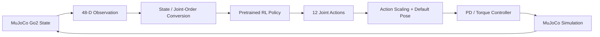

# Sim-to-Sim Quadruped Locomotion in MuJoCo

A compact robotics project for running a **pretrained reinforcement-learning locomotion policy** on a **Unitree Go2 quadruped** in the MuJoCo physics simulator.

The project demonstrates a practical **sim-to-sim transfer pipeline**: robot-state observations are collected in MuJoCo, converted to the ordering expected by the learned policy, passed through a TorchScript policy, and transformed into joint targets that are executed using a PD-style torque controller.

> **Note:** The repository contains a pretrained `policy.pt`. The policy-training pipeline is not part of this repository; this project focuses on policy deployment, simulator interfacing, observation/action mapping, and low-level control.

## Project Overview

The main objective is to execute a learned quadruped locomotion controller in MuJoCo while preserving the observation and action conventions expected by the original training environment.



The control loop includes:

- MuJoCo-based simulation of the Unitree Go2 quadruped
- 48-dimensional policy observation construction
- Base linear and angular velocity information
- Projected gravity / robot orientation information
- Velocity command conditioning
- 12-DoF joint position and velocity feedback
- Previous-action feedback
- Isaac-style ↔ MuJoCo joint-order conversion
- TorchScript policy inference
- Joint target generation
- Torque-limited PD-style control
- Control decimation between physics and policy update rates

## Key Concepts

### 1. Sim-to-Sim Policy Transfer

A policy trained in one simulation framework may expect a particular observation definition, joint order, coordinate convention, and action representation. Running that policy in another simulator therefore requires careful interface alignment.

This implementation handles that deployment layer inside `sim2sim.py`.

### 2. Observation Space

The policy receives a **48-dimensional observation vector** composed of:

| Observation | Dimension |
| --- | ---: |
| Base linear velocity | 3 |
| Base angular velocity | 3 |
| Projected gravity / orientation | 3 |
| Motion command | 3 |
| Joint position offsets | 12 |
| Joint velocities | 12 |
| Previous actions | 12 |
| **Total** | **48** |

### 3. Action Space

The neural policy produces **12 actions**, one for each actuated joint of the quadruped.

The actions are reordered for MuJoCo, scaled, and added to the nominal standing pose:

```python
target_dof_pos = action * action_scale + default_angles
```

### 4. Joint-Order Conversion

The policy and MuJoCo use different arrangements for the 12 leg joints. The project provides two conversion functions:

```python
isaac2mujoco(inputs)
mujoco2isaac(inputs)
```

Correct joint mapping is essential for transferring a locomotion policy across simulators.

### 5. Low-Level Torque Control

The policy predicts joint-level commands rather than applying raw torques directly. A PD-style controller converts target joint positions into actuator efforts, with torque saturation based on actuator and joint-velocity limits.

Conceptually:

```text
Policy action
    ↓
Target joint position
    ↓
Position error + joint velocity
    ↓
PD-style controller
    ↓
Torque / actuator effort
    ↓
MuJoCo robot
```

## Repository Structure

```text
.
├── sim2sim.py
├── policy.pt
└── robots/
    ├── go1/
    │   ├── assets/
    │   ├── go1.xml
    │   └── scene.xml
    └── go2/
        ├── assets/
        ├── go2.xml
        ├── go2_mjx.xml
        ├── scene.xml
        └── scene_mjx.xml
```

The current simulation script uses:

```text
robots/go2/scene.xml
```

## Requirements

Recommended environment:

- Python 3.10+
- MuJoCo
- NumPy
- PyTorch
- SciPy

Install the Python dependencies with:

```bash
pip install mujoco numpy torch scipy
```

> Depending on your operating system and PyTorch configuration, you may prefer to install PyTorch using the command recommended on the official PyTorch website.

## Running the Project

Clone the repository and enter the project directory:

```bash
git clone <your-repository-url>
cd <repository-name>
```

Install dependencies:

```bash
pip install mujoco numpy torch scipy
```

Run the simulation:

```bash
python sim2sim.py
```

A MuJoCo viewer should open and execute the locomotion policy on the Go2 model.

## Main Configuration

Important parameters are defined in the `config` dictionary in `sim2sim.py`:

```python
config = {
    "policy_path": "./policy.pt",
    "xml_path": "./robots/go2/scene.xml",
    "simulation_duration": 3000,
    "simulation_dt": 0.002,
    "control_decimation": 10,
    "kps": 50.0,
    "kds": 0.1,
    "action_scale": 0.2,
    "num_actions": 12,
    "num_obs": 48,
    "cmd_init": [1.5, 0.0, 0.0]
}
```

**Implementation note:** in the current code, `pd_control()` delegates to `joint_torque()`, whose internal controller uses default stiffness `50.0` and damping `0.5`. The `kps`/`kds` arguments in the configuration are therefore not fully propagated into the final torque computation. This is a useful point to clean up if the controller is extended.

With a simulation timestep of `0.002 s` and control decimation of `10`, physics is stepped at approximately **500 Hz**, while the learned policy is evaluated approximately every **20 ms (50 Hz)**.

The default command is:

```python
cmd_init = [1.5, 0.0, 0.0]
```

which represents the three command values supplied to the locomotion policy.

## Technical Highlights

This project provides hands-on experience with:

- Reinforcement learning policy deployment
- Legged robot locomotion
- Robot simulation with MuJoCo
- Sim-to-sim transfer
- Coordinate and joint-space transformations
- Quaternion-based orientation processing
- Robot observation design
- Neural-network policy inference with PyTorch/TorchScript
- Joint-space control
- PD control and actuator saturation
- Multi-rate simulation and control loops

## Potential Extensions

Several research-oriented extensions can be built on top of the current pipeline:

- **Dynamics randomization:** vary mass, friction, actuator strength, and contact parameters.
- **Robustness evaluation:** measure locomotion performance under external disturbances.
- **Sensor uncertainty:** add noise or delay to joint, velocity, and orientation measurements.
- **Command tracking analysis:** evaluate tracking error across different desired velocities.
- **Safety-aware control:** introduce constraints or a safety layer around learned actions.
- **Adaptive control:** compensate for model mismatch between training and deployment simulators.
- **Sim-to-real preparation:** investigate which simulator discrepancies most strongly affect transfer to a physical quadruped.

These extensions connect learned locomotion with broader research topics in **reinforcement learning, autonomous systems, robust/adaptive control, and safe robotics**.

## Research Motivation

Reliable deployment of learning-based controllers requires more than training a policy. The observation space, coordinate conventions, actuator limits, control frequency, robot dynamics, and low-level controller must remain consistent across environments.

This project explores that deployment problem through a quadruped locomotion example and provides a foundation for studying **robust learning-enabled control under simulator mismatch and uncertainty**.

## Acknowledgment and Attribution

This repository uses a **pretrained TorchScript locomotion policy** and robot model/assets supplied with the project materials. The focus of this implementation is the MuJoCo deployment and sim-to-sim control pipeline.

Before redistributing the pretrained policy or Unitree robot meshes/XML files publicly, verify the **original source, license, and redistribution terms** for those assets and add the appropriate attribution here.

## Disclaimer

This repository is intended for educational and research purposes. Results obtained in simulation do not by themselves demonstrate safe operation on physical hardware.
